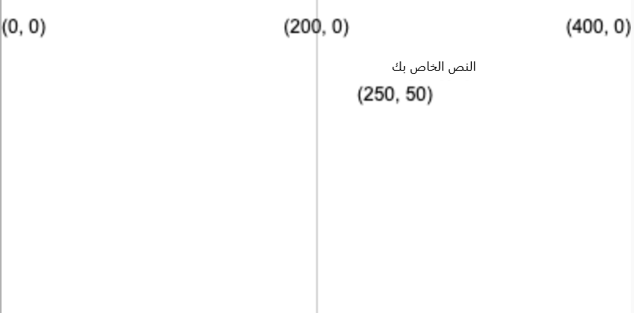
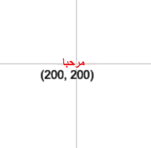

ارسم نصًا باستخدام: `text('النص المراد عرضه', x, y)`

سيتم رسم النص باستخدام القيمة `fill` التي قمت بتعيينها قبل استدعاء `text`.

```python

text('نصك', 250, 50)

```

سيتم وضع النص عند إحداثيات (y, x) المعطاة من الرقمين.



يمكنك أيضًا تعديل النص باستخدام:

```python

text_align(horizontal_position, vertical_position) 

```

الذي يعدل موضع النص داخل المربع غير المرئي الذي تقوم بإنشائه عند الإحداثيات الهدف. يتضمن P5 متغيرات خاصة لكل موضع قد ترغب في استخدامه:

 - `horizontal_position` of `LEFT` سيحاذي النص إلى يسار مربع النص
 - `horizontal_position` of `CENTER` سيؤدي إلى توسيط النص أفقيًا في مربع النص
 - `horizontal_position` of `RIGHT` سيحاذي النص إلى يمين مربع النص
 - `vertical_position` of `TOP` سيحاذي النص إلى أعلى مربع النص
 - `vertical_position` of `CENTER` سيحاذي النص إلى منتصف مربع النص
 - `vertical_position` of `BOTTOM` سيحاذي النص إلى أسفل مربع النص

```python

text_size(size)

```

الذي يقبل عددًا بالبكسل يمثل حجم الخط الذي تريده.

على سبيل المثال ، لإنشاء كلمة "مرحبًا" ، بنص أحمر يبلغ ارتفاعه 16 بكسل ، يتم توسيطه على لوحة 400 ، 400 ، يمكنك استخدام:

```python

fill(200, 0, 0)
text_size(16)
text_align(CENTER, CENTER)
text('مرحبًا', 200, 200)

```



