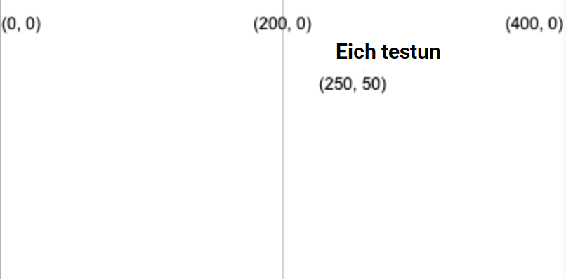
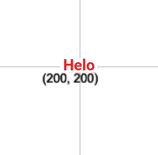

Lluniwch destun gan ddefnyddio: `text('Text to display', x, y)`

Bydd y testun yn cael ei lunio gan ddefnyddio'r gwerth `fill` rydych chi wedi'i osod cyn bod `text` yn cael ei galw.

```python

text('Eich testun', 250, 50)

```

Bydd y testun wedi'i leoli yn y cyfesurynnau (x, y) sy'n cael eu rhoi gan y ddau rif.



Fe allwch chi hefyd addasu'r testun drwy ddefnyddio:

```python

text_align(horizontal_position, vertical_position) 

```

Mae hyn yn addasu safle'r testun tu mewn i'r bocs anweledig rydych chi'n ei greu yn y cyfesurynnau targed. Mae P5 yn cynnwys newidynnau arbennig ar gyfer pob safle byddwch chi eisiau eu defnyddio o bosib:

 - Bydd `horizontal_position` `LEFT` yn alinio'r testun i chwith y blwch testun
 - Bydd `horizontal_position` `CENTER` yn canoli'r testun yn y blwch testun yn llorweddol
 - Bydd `horizontal_position` `RIGHT` yn alinio'r testun i dde y blwch testun
 - Bydd `vertical_position` `TOP` yn alinio'r testun i frig y blwch testun
 - Bydd `vertical_position` `CENTER` yn alinio'r testun i ganol y blwch testun
 - Bydd `vertical_position` `BOTTOM` yn alinio'r testun i waelod y blwch testun

```python

text_size(size)

```

Sy'n derbyn nifer mewn picseli sy'n cynrychioli'r maint ffont o'ch dewis.

Er enghraifft, i greu'r gair "Helo" mewn testun coch 16 picsel, wedi'i ganoli ar ganfas 400, 400, byddech chi'n defnyddio:

```python

fill(200, 0, 0)
text_size(16)
text_align(CENTER, CENTER)
text('Helo', 200, 200)

```

 
