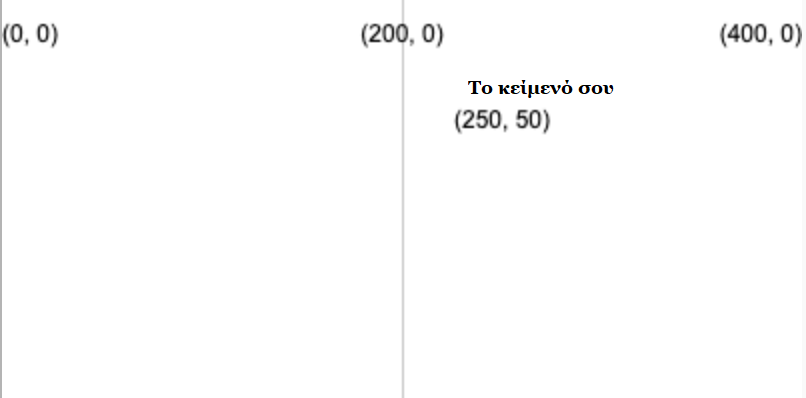
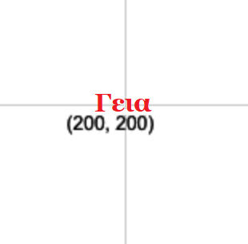

Σχεδίασε κείμενο χρησιμοποιώντας τη συνάρτηση: `text('Κείμενο προς εμφάνιση', x, y)`

Το κείμενο θα σχεδιαστεί χρησιμοποιώντας την τιμή `fill` που έχεις ορίσει πριν καλέσεις το `text`.

```python

text('Το κείμενό σου', 250, 50)

```

Το κείμενο θα τοποθετηθεί στις συντεταγμένες (x, y) που δίνονται από τους δύο πρώτους αριθμούς.



Μπορείς επίσης να προσαρμόσεις το κείμενο χρησιμοποιώντας:

```python

text_align(horizontal_position, vertical_position) 

```

Το οποίο προσαρμόζει τη θέση του κειμένου μέσα στο αόρατο πλαίσιο που δημιουργείς στις συντεταγμένες προορισμού. Η βιβλιοθήκη p5 περιλαμβάνει ειδικές μεταβλητές για κάθε θέση που μπορεί να θέλεις να χρησιμοποιήσεις:

 - Μια `horizontal_position` του `LEFT` θα ευθυγραμμίσει το κείμενο στα αριστερά του πλαισίου κειμένου
 - Μια `horizontal_position` του `CENTER` θα κεντράρει οριζόντια το κείμενο στο πλαίσιο κειμένου
 - Μια `horizontal_position` του `RIGHT` θα ευθυγραμμίσει το κείμενο στα δεξιά του πλαισίου κειμένου
 - Μια `vertical_position` του `TOP` θα ευθυγραμμίσει το κείμενο στην κορυφή του πλαισίου κειμένου
 - Μια `vertical_position` του `CENTER` θα ευθυγραμμίσει το κείμενο στη μέση του πλαισίου κειμένου
 - Μια `vertical_position` του `BOTTOM` θα ευθυγραμμίσει το κείμενο στο κάτω μέρος του πλαισίου κειμένου

```python

text_size(size)

```

Το οποίο δέχεται έναν αριθμό σε εικονοστοιχεία που αντιπροσωπεύει το μέγεθος γραμματοσειράς που θέλεις.

Για παράδειγμα, για να δημιουργήσεις τη λέξη "Γεια", σε κόκκινο κείμενο ύψους 16 pixel, με κέντρο 400, 400, στον καμβά θα χρησιμοποιούσες:

```python

fill(200, 0, 0)
text_size(16)
text_align(CENTER, CENTER)
text('Γεια', 200, 200)

```



