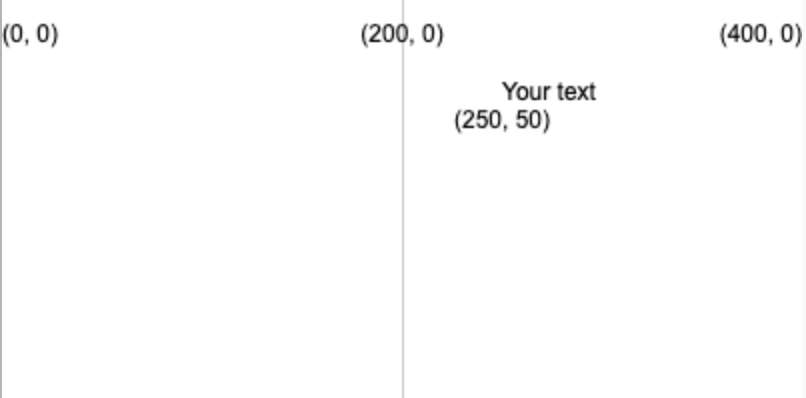
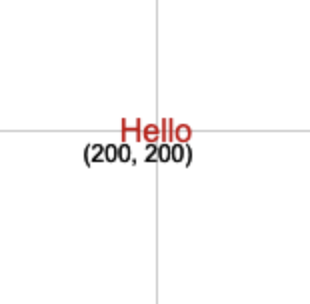

Draw text using: `text('Text to display', x, y)`

The text will be drawn using the `fill` value you have set before `text` is called.

```python
text('Your text', 250, 50)
```

The text will be positioned at the (x, y) coordinates given by the two numbers.



You can also adjust the text by using:

```python
text_align(horizontal_position, vertical_position) 
```

Which adjusts the position of the text inside the invisible box you create at the target coordinates. P5 includes special variables for each of the position you might want to use:

 - A `horizontal_position` of `LEFT` will align the text to the left of the text box
 - A `horizontal_position` of `CENTER` will horizontally centre the text in the text box
 - A `horizontal_position` of `RIGHT` will align the text to the right of the text box
 - A `vertical_position` of `TOP` will align the text to the top of the text box
 - A `vertical_position` of `CENTER` will align the text to the middle of the text box
 - A `vertical_position` of `BOTTOM` will align the text to the bottom of the text box

```python
text_size(size)
```

Which accepts a number in pixels that represents the font size you want.

For example, to create the word "Hello", in red 16 pixel high text, centred on a 400, 400 canvas, you would use:

```python
fill(200, 0, 0)
text_size(16)
text_align(CENTER, CENTER)
text('Hello', 200, 200)
```

 