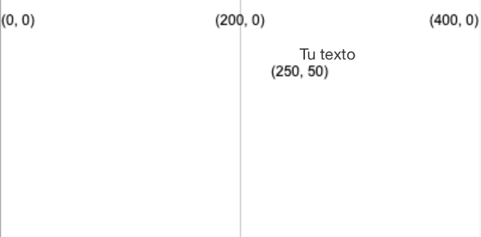
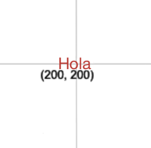

Puedes agregar texto usando: `text('Texto a mostrar', x, y)`

El texto se creará utilizando el valor que le hayas dado a `fill` (relleno) antes de llamar a la función `text` (texto).

```python

text('Tu texto', 250, 50)

```

El texto se colocará en las coordenadas (x, y) definidas por los dos números.



También puedes ajustar la posición del texto usando:

```python

text_align(posicion_horizontal, posicion_vertical) 

```

Esta función ajusta la posición del texto dentro del cuadro invisible que creaste en las coordenadas de destino. P5 incluye variables especiales para cualquiera de las posiciones que quieras usar:

 - Si defines `posicion_horizontal` como `LEFT` el texto se alineará a la izquierda del cuadro de texto
 - Si defines `posicion_horizontal` como `CENTER` el texto se centrará horizontalmente en el cuadro de texto
 - Si defines `posicion_horizontal` como `RIGHT` el texto se alineará a la derecha del cuadro de texto
 - Si defines `posicion_vertical` como `TOP` el texto se alineará arriba del cuadro de texto
 - Si defines `posicion_vertical` como `CENTER` el texto se alineará al medio del cuadro de texto
 - Si defines `posicion_vertical` como `BOTTOM` el texto se alineará debajo del cuadro de texto

```python

text_size(tamaño)

```

Esta función acepta un número en píxeles que representa el tamaño de fuente que desees usar.

Por ejemplo, para crear la palabra "Hola", en texto rojo de 16 píxeles de alto, centrado en una cuadrícula de 400 por 400, usarías:

```python

fill(200, 0, 0)
text_size(16)
text_align(CENTER, CENTER)
text('Hola', 200, 200)

```



