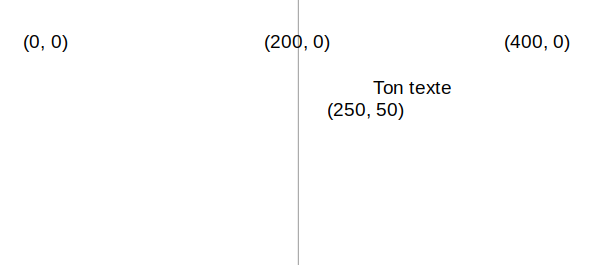
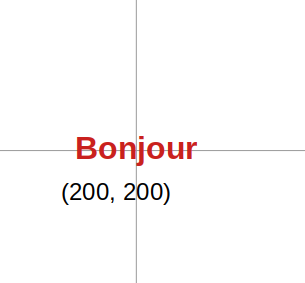

Dessiner du texte en utilisant : `text('Texte à afficher', x, y)`

Le texte sera dessiné en utilisant la valeur `fill` que tu as définie avant que `text` ne soit appelé.

```python

text('Ton texte', 250, 50)

```

Le texte sera positionné aux coordonnées (x, y) données par les deux nombres.



Tu peux également ajuster le texte en utilisant :

```python

text_align(position_horizontale, position_verticale) 

```

Ce qui ajuste la position du texte à l'intérieur de la boîte invisible que tu crées aux coordonnées cibles. P5 inclut des variables spéciales pour chacune des positions que tu pourrais vouloir utiliser :

 - Une `position_horizontale` à `LEFT` alignera le texte à gauche de la zone de texte
 - Une `position_horizontale` à `CENTER` centrera horizontalement le texte dans la zone de texte
 - Une `position_horizontale` à `RIGHT` alignera le texte à droite de la zone de texte
 - Une `position_verticale` à `TOP` alignera le texte en haut de la zone de texte
 - Une `position_verticale` à `CENTER` alignera le texte au milieu de la zone de texte
 - Une `position_verticale` à `BOTTOM` alignera le texte au bas de la zone de texte

```python

text_size(taille)

```

Qui accepte un nombre en pixels qui représente la taille de police souhaitée.

Par exemple, pour créer le mot « Bonjour », en texte rouge de 16 pixels de haut, centré sur un canevas 400, 400, tu utiliserais :

```python

fill(200, 0, 0)
text_size(16)
text_align(CENTER, CENTER)
text('Bonjour', 200, 200)

```

 
