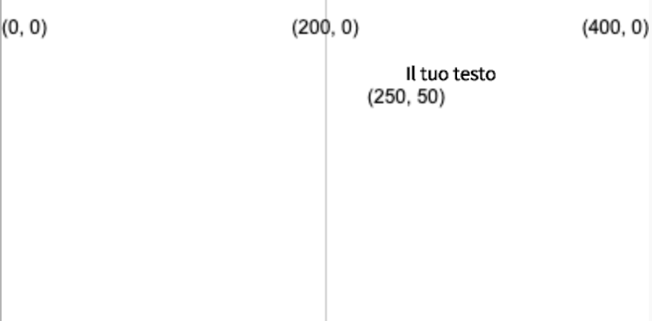
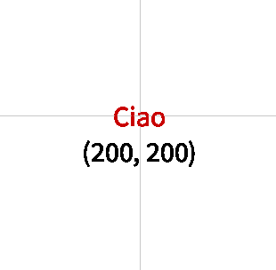

Disegna il testo utilizzando: `text('Testo da visualizzare', x, y)`

Il testo verrà disegnato utilizzando il valore `fill` impostato prima che venga chiamato `text`.

```python

text('Il tuo testo', 250, 50)

```

Il testo verrà posizionato alle coordinate (x, y) date dai due numeri.



Puoi anche modificare il testo utilizzando:

```python

text_align(posizione_orizzontale, posizione_verticale) 

```

Che regola la posizione del testo all'interno della casella invisibile creata nelle coordinate di destinazione. P5 include variabili speciali per ciascuna posizione che potresti voler utilizzare:

 - Imposta `posizione_orizzonatale` a `LEFT` per allineare il testo a sinistra della casella di testo
 - Imposta `posizione_orizzonatale` a `CENTER` per allineare il testo al centro della casella di testo
 - Imposta `posizione_orizzonatale` a `RIGHT` per allineare il testo a destra della casella di testo
 - Imposta `posizione_verticale` a `TOP` per allineare il testo alla parte superiore della casella di testo
 - Imposta `posizione_verticale` a `CENTER` per allineare il testo nel mezzo della casella di testo
 - Imposta `posizione_verticale` a `BOTTOM` per allineare il testo alla parte inferiore della casella di testo

```python

text_size(dimensione)

```

Che accetta un numero in pixel che rappresenta la dimensione del carattere desiderata.

Ad esempio, per creare la parola "Ciao", con testo rosso alto 16 pixel, centrato su una tela 400x400, dovresti utilizzare:

```python

fill(200, 0, 0)
text_size(16)
text_align(CENTER, CENTER)
text('Ciao', 200, 200)

```

 
