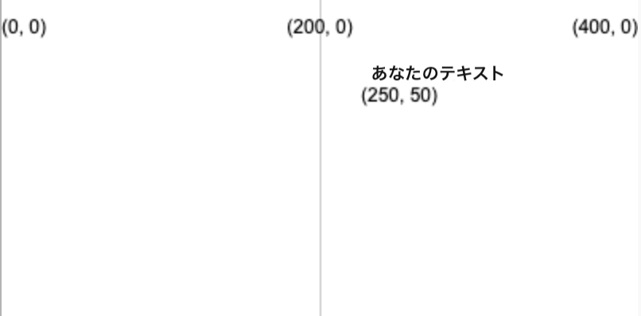
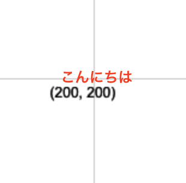

テキストを描くにはこれを使います:  `text('表示するテキスト', x, y)`

テキストは、 `text` が呼び出される前に設定した `fill` の値を使用して描かれます。

```python

text('あなたのテキスト', 250, 50)

```

テキストは、2つの数字で指定された(x, y)座標に配置されます。



次のようにしてテキストの位置を調整することもできます。

```python

text_align(horizontal_position, vertical_position) 

```

これは、ターゲット座標に作成した見えないボックス内のテキストの位置を調整します。 P5には、あなたが使用することができる位置を示す特別な変数があります。

 - `horizontal_position` に `LEFT` を使うと、テキストをテキストボックスの左側に寄せます
 - `horizontal_position` に `CENTER` を使うと、テキストをテキストボックスの水平方向の中央に寄せます
 - `horizontal_position` に `RIGHT` を使うと、テキストをテキストボックスの右側に寄せます
 - `vertical_position` に `TOP` を使うと、テキストをテキストボックスの上側に寄せます
 - `vertical_position` に `TOP` を使うと、テキストをテキストボックスの中央に寄せます
 - `vertical_position` に `BOTTOM` を使うと、テキストをテキストボックスの下側に寄せます

```python

text_size(size)

```

これは、希望のフォントサイズをピクセル単位で表した数値で指定するものです。

たとえば、400、400のキャンバスの中央に、高さ16ピクセルの赤いテキストで「こんにちは」という言葉を表示するには、次のようにします。

```python

fill(200, 0, 0)
text_size(16)
text_align(CENTER, CENTER)
text('こんにちは', 200, 200)

```

 
