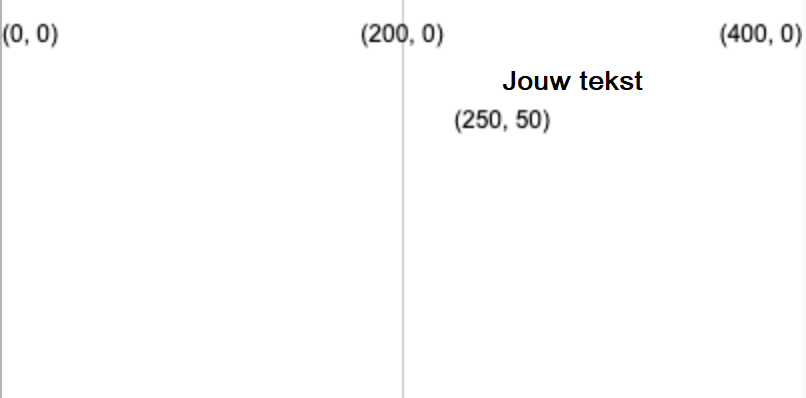
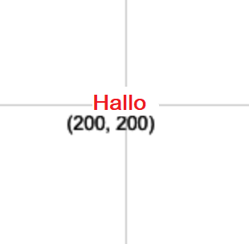

Maak tekst met: `text('Tekst om weer te geven', x, y)`

De tekst wordt gemaakt met de `fill` waarde die je hebt ingesteld voordat `text` wordt aangeroepen.

```python

text('Jouw tekst', 250, 50)

```

De tekst wordt gepositioneerd op de (x, y) coördinaten die door de twee getallen worden gegeven.



Je kunt de tekst ook aanpassen met:

```python

text_align(horizontale_positie, verticale_positie) 

```

Waarmee je de positie van de tekst aanpast binnen de onzichtbare rechthoek die je op de doelcoördinaten maakt. P5 bevat speciale variabelen voor elk van de posities die je mogelijk wilt gebruiken:

 - Een `horizontale_positie` van `LEFT` zal de tekst links in het tekstvak uitlijnen
 - Een `horizontale_positie` van `CENTER` centreert de tekst horizontaal in het tekstvak
 - Een `horizontale_positie` van `RIGHT` zal de tekst rechts in het tekstvak uitlijnen
 - Een `verticale_positie` van `TOP` lijnt de tekst uit met de bovenkant van het tekstvak
 - Een `verticale_positie` van `CENTER` zal de tekst uitlijnen in het midden van het tekstvak
 - Een `verticale_positie` van `BOTTOM` lijnt de tekst uit met de onderkant van het tekstvak

```python

text_size(grootte)

```

Hiermee stel je een getal in pixels in voor de gewenste lettergrootte.

Als je bijvoorbeeld het woord "Hallo" wilt maken in rode tekst van 16 pixels hoog, gecentreerd op een 400, 400 canvas, gebruik je:

```python

fill(200, 0, 0)
text_size(16)
text_align(CENTER, CENTER)
text('Hallo', 200, 200)

```

 
