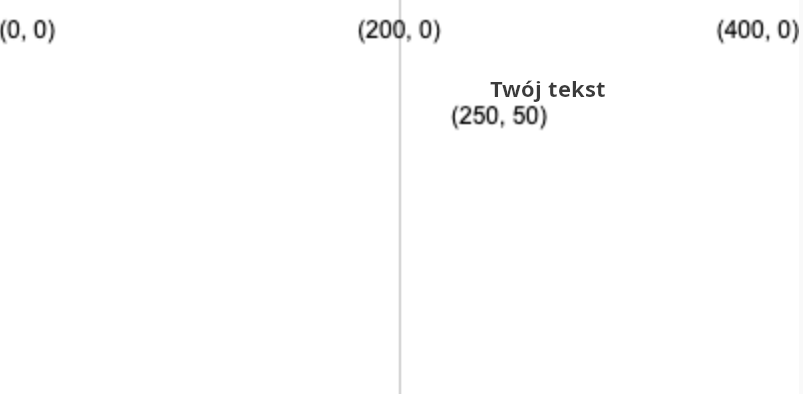
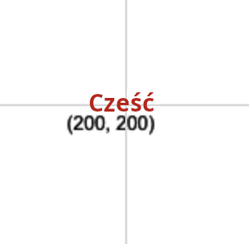

Narysuj tekst używając: `text('Tekst do wyświetlenia', x, y)`

Tekst zostanie narysowany przy użyciu wartości `wypełnienia` ustawionej przed wywołaniem `tekstu`.

```python

text('Twój tekst', 250, 50)

```

Tekst zostanie umieszczony we współrzędnych (x, y) przez podanie dwóch liczb.



Możesz również dostosować tekst, używając:

```python

text_align(położenie_poziome, położenie_pionowe) 

```

Który dostosowuje pozycję tekstu w niewidocznym polu, które tworzysz na docelowych współrzędnych. P5 zawiera specjalne zmienne dla każdej pozycji, której możesz chcieć użyć:

 - A `horizontal_position` of `LEFT` will align the text to the left of the text box
 - `horizontal_position` z `CENTER` spowoduje wyśrodkowanie tekstu w polu tekstowym w poziomie
 - A `horizontal_position` of `RIGHT` will align the text to the right of the text box
 - `vertical_position` z `TOP` spowoduje wyrównanie tekstu do górnej części pola tekstowego
 - A `vertical_position` of `CENTER` will align the text to the middle of the text box
 - `polozenie_pionowe` z `BOTTOM` spowoduje wyrównanie tekstu do dołu pola tekstowego

```python

text_size(rozmiar)

```

Który akceptuje liczbę w pikselach, która reprezentuje żądany rozmiar czcionki.

Na przykład, aby utworzyć słowo „Hello” w czerwonym tekście o wysokości 16 pikseli, wyśrodkowane na płótnie 400, 400, użyjesz:

```python

fill(200, 0, 0)
text_size(16)
text_align(CENTER, CENTER)
text('Hello', 200, 200)

```

 
