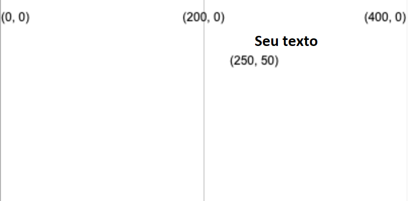
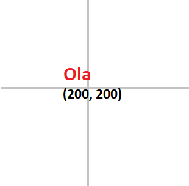

Crie texto usando: `text('Texto a ser exibido', x, y)`

O texto será criado usando o valor `fill` que você definiu antes do `text` ser chamado.

```python

text('Seu texto', 250, 50)

```

O texto será posicionado nas coordenadas (x, y) dadas pelos dois números.



Você também pode ajustar o texto usando:

```python

text_align(posição_horizontal, posição_vertical) 

```

Que ajusta a posição do texto dentro da caixa invisível que você cria nas coordenadas escolhidas. P5 inclui variáveis especiais para cada uma das posições que você pode querer usar:

 - Uma `posição_horizontal` `LEFT` alinhará o texto à esquerda da caixa de texto
 - Uma `posição_horizontal` `CENTER` alinhará o texto ao centro horizontal da caixa de texto
 - Uma `posição_horizontal` `RIGHT` alinhará o texto à direita da caixa de texto
 - Uma `posição_vertical` `TOP` alinhará o texto ao topo da caixa de texto
 - Uma `posição_vertical` `CENTER` alinhará o texto no meio da caixa de texto
 - Uma `posição_vertical` `BOTTOM` alinhará o texto à parte inferior da caixa de texto

```python

text_size(tamanho)

```

Que aceita um número em pixels que representa o tamanho da fonte que você deseja.

Por exemplo, para criar a palavra "Olá", em vermelho, com 16 pixels de altura e centralizado em uma tela de 400 x 400, você usaria:

```python

fill(200, 0, 0)
text_size(16)
text_align(CENTER, CENTER)
text('Olá', 200, 200)

```


