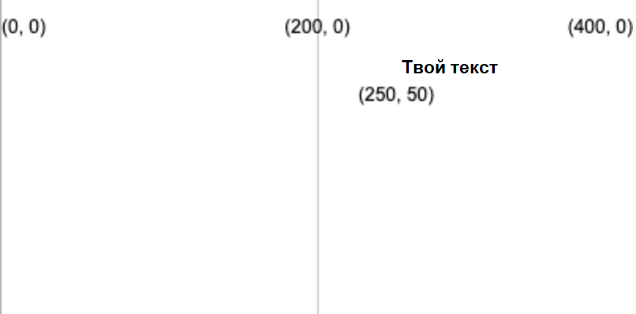
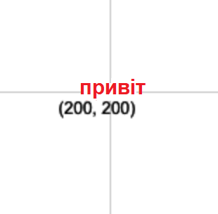

Виведення тексту за допомогою: `text('Текст для виведення', x, y)`

Текст буде створений з використанням значень `fill`, які були визначені тобою раніше, перед тим, як буде виконана функція `text`.

```python

text('Твій текст', 250, 50)

```

Текст буде розміщено на координатах (x, y), які задаються двома числами.



Ти також можеш визначити позицію тексту за допомогою:

```python

text_align(horizontal_position, vertical_position) 

```

Цей код встановлює положення тексту всередині створюваного тобою невидимого поля по встановленим координатам. P5 має спеціальні змінні для кожної позиції, яку ти можеш використовувати:

 - `horizontal_position` + `LEFT` вирівняє текст по лівому краю текстового поля
 - `horizontal_position` + `CENTER` вирівняє текст у текстовому полі по горизонталі
 - `horizontal_position` + `RIGHT` вирівняє текст по правому краю текстового поля
 - `vertical_position` + `TOP` вирівняє текст по верхньому краю текстового поля
 - `vertical_position` + `CENTER` вирівняє текст по центру текстового поля
 - `vertical_position` + `BOTTOM` вирівняє текст по нижньому краю текстового поля

```python

text_size(size)

```

Цей код приймає значення в пікселях, яке відображає розмір шрифту, який ти хочеш отримати.

Наприклад, щоб створити слово "Привіт", потрібно використати червоний текст висотою 16 пікселів, розміщений по центру полотна розміром 400 на 400 пікселів:

```python

fill(200, 0, 0)
text_size(16)
text_align(CENTER, CENTER)
text('Привіт', 200, 200)

```



***
Цей проєкт переклали волонтери:

[name]

[name]

[name]

Завдяки волонтерам, ми надаємо можливість людям у всьому світі навчатися рідною мовою. Ви також можете допомогти нам у цьому — більше інформації про волонтерську програму на [rpf.io/translate](https://rpf.io/translate).
